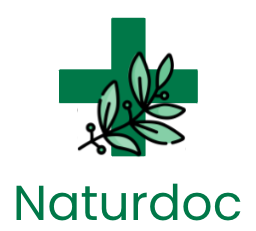

<p align="center">

</p>

<div align="center">

Find natural remedies from different medical traditions

</div>

<div align="center">


   

</div>

&nbsp;

<h5 align="center">
  <a href="#About">About</a>  |
  <a href="#Prototype">Prototype</a>  |
  <a href="#Setup">Setup</a>  |
  <a href="#Running">Run</a>  |
  <a href="#Authors">Authors</a>
</h5>


## About

Naturdoc is a M.E.R.N app that lets users find the best natural remedies to their common symptoms, in two clicks only,</br> thanks to a combination of data science research and user-generated reviews.</br> </br> With the help of Naturdoc, you can learn about the range of applications for each remedy,</br>  rate the remedy and exchange your experience in the comments with other users. </br> Our inbuilt doctor-alert is symptom based and notifies you when you should seek medical help.</br> </br>  We hope you get better soon!

&nbsp;

## Prototype

[Link to video proto here]

&nbsp;

## Setup

### Setting Up The Correct .env File:
To ensure that our credentials are not exposed on Github, we have set up a <code>.env</code> file containing necessary data to connect to our MongoDB Atlas database. 

There needs to be a <code>.env</code> file in both the _backend_ as well as the _pythonapi_ folder.

The <code>.env</code> file contains data in the following format:
```
#MONGO CONFIG
MONGO_URI=mongodb+srv://<user>:<password>@<cluster>.aj9zhtw.mongodb.net/<user>?retryWrites=true&w=majority
```
Therefore, to be able to connect to the database, please contact members of the team to receive the necessary credentials.

&nbsp;

### Python Install:
To receive remedy recommendation from the Data Science API, Python 3 needs to be installed. We used Python3.8 with FastAPI, so we recommend choosing the same version.

* [Download Python for Windows](https://www.python.org/downloads/windows/) and [Installation Docs for Windows](https://docs.python.org/3.8/using/windows.html)
* [Python for Mac](https://www.python.org/downloads/macos/) and [Installation Docs for Mac](https://docs.python.org/3.8/using/mac.html)

&nbsp;

### Clone Into The Git Repository:
To pull this application to your local machine, execute the following commands from your command line:

```
git clone https://github.com/TechLabs-Berlin/wt23-naturdoc.git
```

&nbsp;

### Installing Necessary Dependencies:
To install required dependencies for JavaScript and Python, execute the following commands from your command line:

1. Move to the newly cloned project directory, then navigate to the app folder
```
cd wt23-naturdoc

cd app
```
2. Navigate to the **frontend folder**, then install the dependencies:
```
cd frontend

npm i
```

3. Navigate to the **backend folder**, then install the dependencies:
```
cd ..

cd backend

npm i
```

4. Navigate to the **Python API folder**, and install Python dependencies
```
cd ..

cd pythonapi

pip install -r requirements.txt
```

If there are several Python versions installed, users might have to specify the version and run <code>python3.8 -m pip install -r requirements.text</code> instead.

&nbsp;
&nbsp;

## Running
1. Navigate to the **frontend folder** to start the app
```
cd ..

cd frontend

npm start
```
2. Navigate to the **backend folder** to start the local server (serving port 7000)
```
cd ..

cd backend

npm start
```
3. Navigate to the **Python API folder** to start the local server - FastAPI (serving port 8000)
```
cd ..

cd pythonapi

uvicorn main:app --reload
```

&nbsp;
&nbsp;

## Authors
Data Science:&nbsp;&nbsp;&nbsp;&nbsp;&nbsp;&nbsp;&nbsp;&nbsp; [Aljoscha Beiers](https://github.com/alj-b) &nbsp;

&nbsp;&nbsp;&nbsp;&nbsp;&nbsp;&nbsp;&nbsp;&nbsp;&nbsp;&nbsp;&nbsp;&nbsp;&nbsp;&nbsp;&nbsp;&nbsp;&nbsp;&nbsp;&nbsp;&nbsp;&nbsp;&nbsp;&nbsp;&nbsp;&nbsp;&nbsp;&nbsp;&nbsp;&nbsp;&nbsp;&nbsp;&nbsp; [Anna Stergianou](https://github.com/annastergianou) &nbsp;

WD Frontend:&nbsp;&nbsp;&nbsp;&nbsp;&nbsp;&nbsp;&nbsp;&nbsp; [Rose Jeantet](https://github.com/rjeantet) &nbsp;

WD Backend:&nbsp;&nbsp;&nbsp;&nbsp;&nbsp;&nbsp;&nbsp;&nbsp;&nbsp; [Christina Dechent](https://github.com/ChristinaLisa) &nbsp;

User Experience:&nbsp;&nbsp;&nbsp; [Luzie](https://github.com/hotmail030) &nbsp;

&nbsp;&nbsp;&nbsp;&nbsp;&nbsp;&nbsp;&nbsp;&nbsp;&nbsp;&nbsp;&nbsp;&nbsp;&nbsp;&nbsp;&nbsp;&nbsp;&nbsp;&nbsp;&nbsp;&nbsp;&nbsp;&nbsp;&nbsp;&nbsp;&nbsp;&nbsp;&nbsp;&nbsp;&nbsp;&nbsp;&nbsp;&nbsp;&nbsp; [Eugenia Lezcano](https://github.com/)

&nbsp;
&nbsp;

## Mentors
Data Science:&nbsp;&nbsp;&nbsp;&nbsp;&nbsp;&nbsp;&nbsp;&nbsp;&nbsp;&nbsp;&nbsp; [Rafael Saraiva](https://github.com/JumpingDino) &nbsp;

Web Development:&nbsp;&nbsp; [Soma Hargitai](https://github.com/somahargitai) &nbsp;


