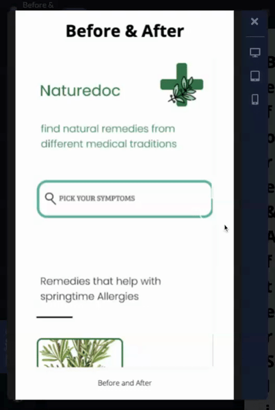
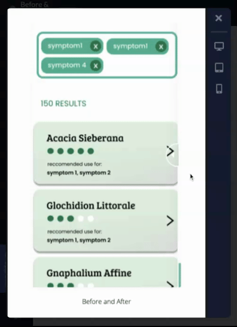
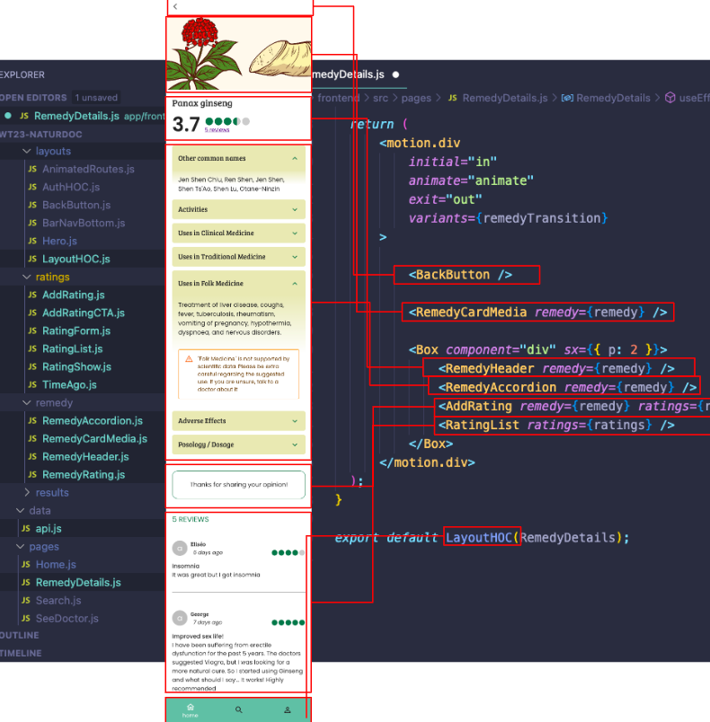
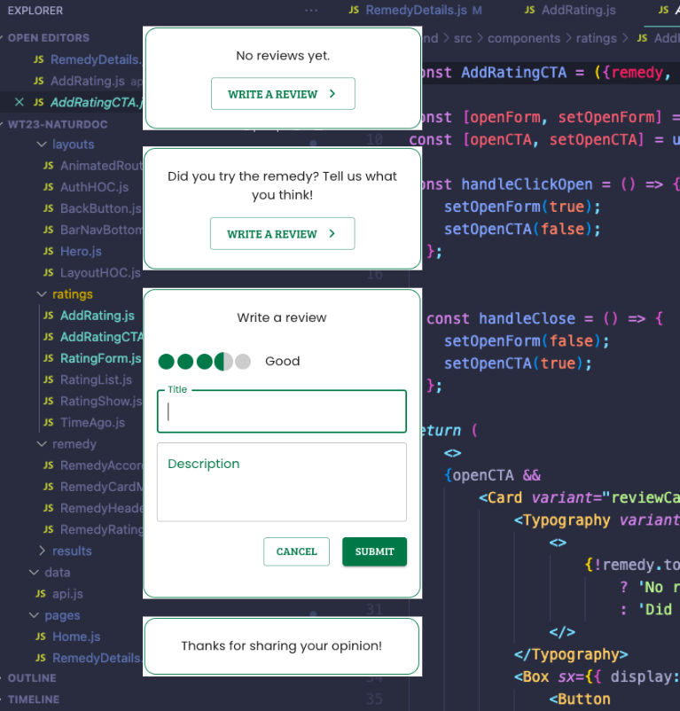

<h5 align="center">

Naturdoc is a M.E.R.N app that lets users find the best natural remedies to their common symptoms, in two clicks only,  thanks to a combination of data science research and user-generated reviews.    With the help of Naturdoc, you can learn about the range of applications for each remedy,   rate the remedy and exchange your experience in the comments with other users.   Our inbuilt doctor-alert is symptom based and notifies you when you should seek medical help.     We hope you get better soon!
</h5>

&nbsp;

<h5 align="center">
  <a href="#UX-Process">UX-Process</a>  |
  <a href="#Frontend">WD Frontend</a>  |
  <a href="#Backend">WD Backend</a>  |
  <a href="#Data Science">Data Science</a>  |
  <a href="#Summary">Summary</a>
</h5>

&nbsp;

# UX-Process 
We started the process by defining the Problem and the Solution of the Product: The problem: How to find the right natural remedies for an ailment? Solution: Create a website that can match the users’ symptoms/disease to the right medication/treatment. It helped us to visit different websites with similar project aims as ours. But we also looked at cooking websites to get inspiration on how we could display the remedies. 

We had a couple discussions about the possible project scope in the Naturedoc team to build a common idea of the final product. Based on user stories, we decided on MVPs and stretch goals. 

We thought about our users and their needs. Additionally, we conducted a short survey. Since we did not have a lot of time to wait for the results of the survey, the participants are mostly acquaintances of ours and therefore very similar in their live situation, place of residence and opinions. 

## Our Challenges 
- Building an easy user flow 
- Making the available dataset user friendly and easy to use. 
- Meeting the risk of people not going to the doctors though being seriously sick 

&nbsp;
&nbsp;

# WD: Frontend

&nbsp;

## The Tech stack:

### React Framework: Create React-App

The no-brainer! After the obvious decision to build the app fully with _React_, I chose to pick Create-React-App as a framework, given that it is one of the most popular in the community.

### UI Framework: MUI

Here the choice was a bit more delicate. On one hand, I had previous experience with Bootstrap and Bulma, on another hand, MUI is also a very popular UI framework for React projects. 

I finally opted for MUI as I was excited to discover some new tools, and after our wonderful mentor [Soma](https://github.com/somahargitai) confirmed that it was a wise choice. The learning curve is quite steep and the documentation is not as intuitive as Bulma's for example, but overall this is a truly awesome framework.

### Dependencies

On top of the dependencies coming along with MUI (ex: emotion), I used the following dependencies:
-   **Axios**: To create HTTP Request
-   **React Router**: for routing in React
-   **Autosuggest-highlight**: for the search-as-you-type feature
-   **Date fns**: for a user-friendly timestamp (posted X months ago)
-   **Framer-motion**: to add some motion between page transitions and simulate the behavior of a mobile app.

&nbsp;
&nbsp;

## Implementing design patterns in code:

### Goal n°1: Fidelity to the design

Such a project has the particularity of different tracks working simultaneously and in parallel. Because of this, I knew that UX would be in a position to provide high-fidelity wireframes only close to the project's due date. We agreed that those would be delivered only a week before Demo day, but successfully communicated very closely all along to achieve our common goal. 

For example, I communicated to them very early that I would work with the MUI framework, so they could make use of MUI Figma plugin. This resulted in a gain of time and productivity for all of us.

There are still some minor differences between the UX and the final App design, mostly because either the functionalities were either not yet specified when I started implementing them or because I lacked time to implement UX final last-minute optimizations. 

But overall I am satisfied with the results towards matching the provided design. 

Here are some before/after examples:

#### :eyes: Home page
  

#### :eyes: Search page

  

#### :eyes: Remedy page

&nbsp;

### Goal n°2: Build and keep consistency, make it reusable

One of the beauties of the React Framework is the possibility to keep the code system consistent thanks to the (re)use of components. In an effort to respect these code design rules, I took the following steps:

- **Implementation of High Order Components**: the "global layouts" elements are created in high order components, that then wrap the children's pages or components. Here, we have one HOC for the global layout (consisting mostly of the main section margins and the bottom navigation bar), as well as one HOC for the authentication page (no navigation bar + closing icon)

- **Creation of a theme.js**: all the styling of the app components is located in the theme.js file. I created there dedicated variants for certain components and typography. Some styling elements are kept directly in the component `(as sx={{...}} )`, the decision came to balancing between the potential reusability of the styling (for example color scheme) versus the easiness to adapt to the specificity of the component (for example margins, paddings...etc...).
   As well, I had to balance between staying true to the original design and having a clean, consistent code. So in some integrations, I chose to sacrifice design fidelity for consistency, for example when bumping into a margin designed at 13px, while all previous margins range in increments of 8px (8px, 16px, 24px...).

- **So many components...!** How much is too much?
   One of the particularities of React is the ease of breaking up our app nicely into components, and rendering them efficiently! But comes a point where we have to decide when and how to design those components.
   As a very junior frontend developer, I personally tried to stick to the following rules (which would for sure evolve with more experience):
	   - Is it or does it have the potential to be reused? => component
	   - Does it have parent/child dependencies => component
	   - How "big" is the current component? Around about 100 lines, I tried to see what would make sense to be refactored into a child component so the reviewers and I can still intuitively understand the code 3 months from now without excessive use of comments.

&nbsp;

### Goal n°3: Relationships And Hierarchy

Thinking ahead of the code design system, the relationship and hierarchy between the different features is a crucial step for creating a clean code app. 

For this project, as a "beginner coding while learning", I did not find much room to plan and think ahead. With more experience and knowledge, I would definitely redesign the app with:
- **pen & paper**: spending more time drawing diagrams of relationships between the components ***before*** even opening VS Code.
- **Redux toolkit**: provides better default behaviors, catches mistakes, and allows writing simpler code.

Yet, for this MVP and as a demonstration, here is an example of the different relationships for the remedy page:

*7 components at the higher lever...* (which themselves have several children components...)

*Zoom on "add rating"*

As simple as it could appears *"just a box with a line of text and a button, right?"*, the AddRating component only connects to two API endpoints (putRatings and getRatings) and has two children components:

The remedy page is a perfect case example where refactoring with the use of Redux toolkit would make sense in the future.

&nbsp;
&nbsp;

## Current limitations and what's next

We feel very satisfied as a young team for having been able to produce most of the MVP features we agreed on. This being said, there are still many things left to be improved or developed. Christina (backend) and I already agreed to keep on working together on improving the app.

-   **Responsiveness**: as we decided to focus on a mobile app, to date no wireframes for other devices have been produced, therefore the MVP version is quite limited in terms of responsiveness, and is better viewed with a 360px wide viewport.

-   **Data persistence, re-rendering, refactoring**: to date the data does not persist between screens, for example when a user goes back to his search after consulting a remedy page. Because we are using the autocomplete component from MUI, adding state persistence via Redux appeared more complicated than expected, so we dropped this feature for the moment, but it remains a priority n°1 to work on for the next iterations.
	As well, the reviews do not re-render yet automatically after submitting the form, and redux toolkit will most probably help fix that annoying bug.

-   **Authentication system:** Connecting the dots between the different API endpoints happened to be much more complicated, bug-inducing, and time-consuming than expected. So we decided to drop this functionality for now, although the API endpoints are implemented on the backend side.

-   **Add to favorites and dashboard page:** After implementing the user authentication, those two features should be on the product backlog for the next version, as the backend already created the add to favorites endpoint and UX designed the dashboard screens.

-   **Deployment & Web standards:** to date, our app is not yet deployed. In the prevision of future deployment, I plan to work more on adjusting to Web Standards, accessibility, and SEO.

- **Testing-driven development:** That is yet another subject that I am excited to learn more about, and apply to this project.

- **Progressive Web App**

&nbsp;
&nbsp;

## Special thanks

This project was definitely a challenging journey. Communications between us, aligning our schedules, learning while coding, parallel work between the different tracks... So many roadblocks that also of course end up being learning and growing factors.

All along this journey, we have been extremely lucky Christina and me, to be mentored by [Soma](https://github.com/somahargitai), who guided us with his experience, knowledge, and kindness, always showing a perfect mix of patience and leadership. 
He did not just help us fix bugs, he made sure we understood why we had those bugs. He did not just tell us to better our code, he explained to us how and why. 
Not only that, but he was always available to help and support us, even minutes before jumping on a plane, and Christina and I are extremely grateful for his support :gift_heart:

**by [Rose](https://github.com/rjeantet)**

&nbsp;
&nbsp;

# WD: Backend

The development process of the backend was challenging especially in the beginning before we decided on a clear MVP and stretch goals and before we decided on a data structure for our remedy recommendations. However, it was great to see the different parts connecting once we had a clealy defined path. 

## Initial project phase - server setup, local DB and user auth:
In the beginning I focussed on getting familiar with using MongoDB and express. After setting up the server, I therefore created a local database which I populated with sample remedy data to be able to work on the API endpoints for the remedy recommendation and the symptoms. When we connected this endpoint to the FE, we initially still used the data from the local database. 
In the meantime I also started working on the user authentication endpoints, because that was going to be needed as a basis for implementing the rating system.The provided user endpoints as of now enable the user to signup, login and logout of the app. 

## Setting up MongoDB Atlas and connecting FE, BE and DS:
Once the datastructure was defined, we set up MongoDB Atlas. After DS had populated the DB, we worked on connecting the three areas to send the remedy recommendations from Python via the backend to the frontend. This was especially challenging because we had worked with sample data before and had not defined a nomenclature for our parameters yet. 

## Development of the rating system 
Once we managed to send the recommendations to the frontend, I concentrated on developing the rating system. Figuring out how to use one-to-one and one-to-many relationships in Mongo was challenging. At the end, I used 4 different Models: user, remedy, rating and symptoms model. The final logic of the rating logic is the following: 
A user can only place one rating per remedy. If the user rates the remedy a second time, the original comment will be overwritten. Hence, 
1. the user model stores one rating for each remedy for that specific user
2. the remedy model stores one rating per user for that specific remedy 
3. the rating model stores one rating per user per remedy

Additionally, the remedy model stores the absolute number of ratings per remedy and the average rating.
Several references are used between these models, for example getting the username from the user model when retrieving data from the ratings model.

### Example for a remedy item DB entry: 

Apart from that, I developed the possibility for users to save their favorite remedies / delete remedies from the list of favorite remedies. This feature is not yet used in our app.

At the moment, we have not implemented the connection for user signup, login and logout between Frontend and backend. We are therefore hardcoding the user Id in the backend code as of now. 

### Example for a user item DB entry:

  

# Data Science

 Early on, we established that the Naturedoc MVP required datasets containing information on symptoms and their possible treatments with natural remedies, particularly through the use of herbs. To that end, for the Data Science aspect of Naturedoc, we generally had to take care of the following tasks:

1. Researching Datasets
2. Data Scraping, Manipulation and Cleaning
3. Machine Learning
4. Visualisation
5. Python API and Recommendation Script

## Researching Datasets

The initial pitch had already provided a couple datasets, however upon closer inspection we realised that they were difficult for us to use. Some of them were hidden behind a pay wall, others included a dataset of images to train models based on image recognition - which did not fit the scope of what Naturedoc needed from us, and we knew that we had to look for other datasets or find possible sources of scraping.

Out of the many different datasets we explored, [Dr. Duke's Phytochemical and Ethnobotanical Databases](https://catalog.data.gov/dataset/dr-dukes-phytochemical-and-ethnobotanical-databases-cecc0) became the solid backbone of our data project. This dataset obviously required further work: on the one hand, we had to extract the essence of what we needed for Naturedoc from its complex information. On the other hand, we also needed to supplement it with more data from other sources to better fit the vision of what we wanted Naturedoc to be.

To that end, we explored other sources of data, such as the [Plants of the World Online](https://powo.science.kew.org/) by the _Royal Botanic Gardens, Kew_, the [WHO monographs on selected medicinal plants](https://apps.who.int/iris/handle/10665/42052) and also considered ways to include Google Trends data into the project.

## Data Scraping, Manipulation and Cleaning

After these initial explorations of available datasets, we proceeded with necessary steps to extract, clean and manipulate the data we found to be able to provide a custom, modified dataset, which would later form the basis of our remedy database on MongoDB Atlas.

This work included pivoting dataframes, e.g. to group all uses for a single herb together in a list (instead of having unique herb and use pairings), removing nan values and certain columns altogether, as well as providing new columns for ratings etc. containing the appropriate datatype so that backend could modify their information once uploaded to the database.

Extracting information from the WHO Monographs as well as trying to use the pytrends library presented particular challenges to us.

Extracting text data from a PDF is a messy process, especially due to the formatting quirks of the original files. In the end, we decided to stop this extraction process after the first two monographs (out of four): we managed to extract more detailed information on treatments for about 70 or so herbs. We consider this as a good _proof of concept_ that worked well enough for the MVP - in our honest opinion, if we do want to have complex written information on how to prepare and ingest the herbs, all their medicinal uses and more, we should not rely on data scraped from elsewhere but base it on our own custom content. Not only do we have legal and ethical concerns about scraping others' intellectual property, but there simply were no sources of data that provided that kind of detailed, written information on more than a handful of herbs at a time, anyway.

## Pytrends

Pytrends is a powerful Python library that enables us to extract Google Trends data. In Naturdoc, we utilized Pytrends to collect search data on different symptoms and herbs. This data helped us to better understand what users are searching for and to rank the most popular herbs for each symptom..Using Pytrends allowed us to identify the most effective remedies for each symptom. We believe that this approach will enable us to provide users with a more personalized and effective experience, making Naturdoc  a valuable resource for anyone seeking natural alternatives to traditional medicine.
Process with Pytrends.

#### Process

Our process with Pytrends involved using it to collect and analyze search data related to herbal remedies. We first had to install the library and import it into our Python environment. We then used the build_payload function to specify the search terms and time range for our data. For example, we may have specified search terms like "ginger tea" and "chamomile" over the past 12 months. Once we built our payload, we used the Interest Over Time function to retrieve the search interest data for those terms.

#### Achievement

One of our major achievements with Pytrends was being able to use the search interest data to improve the ranking of herbal remedies in our app. We were able to identify which remedies were currently trending in popularity and adjust our rankings accordingly. For example, if ginger tea had a high search interest compared to chamomile, we may have boosted ginger tea's ranking in our app.

One design challenge we faced was ensuring that the search terms we used were representative of the remedies we were interested in. For example, we may have used the search term "chamomile tea" instead of just "chamomile" to more accurately reflect the remedy we were interested in.

#### Delivery

In terms of delivery, we were able to successfully use Pytrends to gather and analyze search interest data for a wide range of herbal remedies (EMA Dataset). We were able to incorporate this data into our app to provide more relevant and up-to-date information about natural remedies.
Overall, Pytrends was a valuable tool for our project and helped us to achieve our goals more effectively.

## Machine Learning

We initially had trouble identifying appropriate labels for our data, so a supervised machine learning approach seemed difficult to achieve. And while we already had a Python script in place that sent remedy recommendations to the backend, Naturedoc was faced with another Data Science problem, in that the "symptoms" that we initially provided were... pretty awful:

* The Dr. Duke's dataset provided a column of so called _ACTIVITIES_, paired with a single remedy. 
* Activities were recorded in a specific format that was not very user-friendly and not how a human would freely input a symptom (e.g. head ache as “Ache(Head)”).
* There were many similar, if not downright identical, labels (such as "Abortifacient", "Abortive", "Abortive?").
* The activity column would not just describe symptoms treated, but also included other uses. A single activity could refer to:
    * an illness or symptom treated, such as _diabetes mellitus_ or _fever_
    * a culinary use, such as _spice_
    * a medicinal property, such as _antibiotic_

With some guiding words from our mentor Rafael Saraiva, we then decided on an approach using unsupervised Clustering algorithms that would allow us to solve the symptom-problem as well:

Using word embeddings, we generated a distance matrix and clustered both activities and a set of more user-friendly symptoms based on their semantic proximity, using both a custom Python script as well as [HDBSCAN*](https://hdbscan.readthedocs.io/en/latest/index.html). 

Somewhat disappointingly, the more useable results were provided by our Python script that simply matched data points to one another based on a certain distance threshold, while HDBSCAN* clustering in general produced both more generic and therefore less sensible matches. 

### Word Embeddings

Word embeddings are a popular technique used in natural language processing to represent words or phrases as vectors of numerical values. Word embeddings are a type of language model that map words to numerical vectors in a high-dimensional space. These vectors capture the meaning and relationships between words, allowing algorithms to better understand natural language.

The model we used: 'average_word_embeddings_glove.840B.300d'. While we experimented with another model as well, the results of this model generated much better results for our dataset of symptoms.

Steps:
1. Converting each symptom into an embedding vector.
2. Compare and match them based on their semantic similarity in the embedding space.

## Visualisations

Although the clustering results were maybe not as satisfying as we had hoped, they allowed us to make certain observations when visualising the data. There were two types of visualisations we generated: 
1. Scatterplots of the word embeddings. We used TSNE to reduce the multidimensional embeddings array and visualised clusters created by HDBSCAN*.
2. Linear distance graphs using data of the distance matrix for a single row. 

The data we worked with possesses an inherently high dimensional complexity, and therefore all visualisation in 2D space can be quite misleading. As a general reminder, they are a projection and the displayed distances only tell a part of the story.

This became more obvious when visualising the clusters identified by HDBSCAN*. We generated the maximum amount of clusters possible, and while it looks like sometimes extremely distant data points were clustered together, when we took a look at the specific terms matched, their semantic proximity would become obvious (at least for the most part). 

## Python API and Recommendation Script

Python API, work with Web Dev, align on terms etc.

## Our Challenges

* finding good datasets
* Limitations of the Pytrends API, including daily limits on the number of queries and the need for proxy servers.
* Difficulty in selecting the most relevant search terms to represent each herb.
* Difficulty in comparing the popularity of different herbs due to differences in spelling and naming conventions.
* Keyword ambiguity: Some herb names may have multiple meanings, leading to ambiguity in the search query. For example, the keyword "sage" could refer to the herb or the act of giving wise advice.
* Data reliability: The popularity of a herb may not be solely reflected by its search volume on Google.
* API limitations: Pytrends is an unofficial API and subject to rate limiting or other restrictions that may affect the reliability or consistency of your data.
* Spelling variations: Different regions or cultures may have different spellings for the same herb, leading to inconsistencies in the search results. For example, the herb known as "cilantro" in the US is called "coriander" in the UK
* Language barriers: Pytrends may not support certain languages, making it difficult to collect data on herbs that are primarily used in non-English speaking countries.

  

# Summary 
All in all we are happy with the results. We managed our time well and worked well together as a team. 

# Aknowledgements

We would like to express our sincerest gratitude and appreciation to our mentor Rafael for his unwavering support and invaluable guidance throughout our data science journey. 
Rafael's expertise and dedication have been instrumental in helping us navigate complex data challenges and develop creative solutions that have greatly enhanced the quality and effectiveness of our app.
We are deeply grateful for his patience, wisdom, and willingness to go above and beyond to ensure our success. His unwavering commitment to our growth and development has been a constant source of inspiration and motivation for us.

Thank you, Rafael, for being an outstanding mentor and for always pushing us to reach our full potential. We are proud to have had the opportunity to learn from you, and we look forward to continuing our collaboration in the future.

Sincerely,

Anna and Aljoscha
